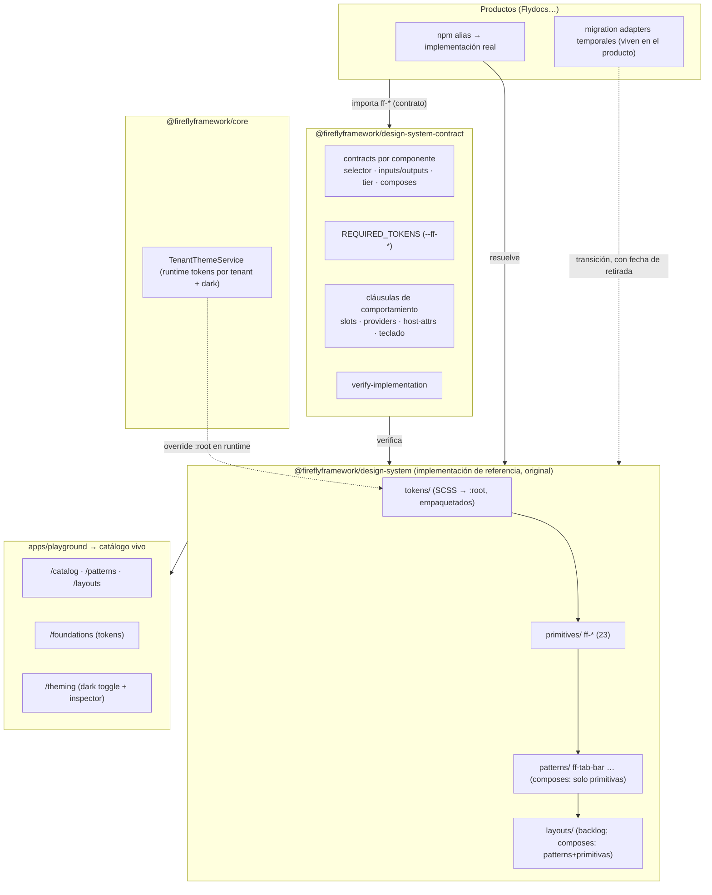

# Firefly Component System and Flydocs Migration Readiness

> Entregable de la iniciativa "Firefly Component System + preparación de migración de Flydocs".
> Fecha: 2026-07-18 · Rama: `feature/firefly-ds-catalog-flydocs-migration` · Repo: `fireflyframework/firefly-frontend-framework`

## 1. Resumen ejecutivo

**Situación de partida.** Flydocs IDP Studio (v0.18.0) pinta su UI directamente con la familia `ng-hub-ui` (17 paquetes, 170 ficheros TS con imports, ~1.400 usos de selectores `hub-*` en templates, 2.587 referencias a tokens `--hub-*`). La doctrina activa del playbook es *hub-first* y las primitivas `ff-*` del framework figuran como deprecadas. Sin embargo, el framework ya contiene un design system propio real: 18 primitivas `ff-*` originales con specs, 711 líneas de tokens `--ff-*` con dark mode, y `TenantThemeService` operativo en `@fireflyframework/core`.

**Hallazgo central del análisis.** Existe una evaluación previa (RFC-001 + FSD "DS desacoplable", 2026-07-14, en BORRADOR) que propone contrato + espejo vivo (fork re-skineado de ng-hub-ui) + internalización progresiva, con dos precondiciones duras no cumplidas: (a) `ng-hub-ui-buttons` y `ng-hub-ui-utils` **no declaran licencia** (copiar/re-skinear su código sería infracción) y (b) la conversación de gobernanza con el maintainer upstream no se ha producido (gate F1/PASO 0.3). En consecuencia, **la vía del espejo está bloqueada hoy**.

**Decisión de esta fase.** Se ejecuta la vía que es legal, compatible con todos los estados finales posibles y que la propia evaluación previa reconoce como flujo natural de lo que "nace in-house": **(1) contrato real** (`@fireflyframework/design-system-contract` deja de ser stub), **(2) implementación propia original** (extender las 18 primitivas existentes hacia el objetivo de 33 componentes, priorizando por uso real en Flydocs, sin copiar una línea de hub-ui), **(3) catálogo navegable** (la app `playground` del monorepo se convierte en showcase de 4 capas según la spec §8), y **(4) preparación completa de la migración** (matrices de equivalencia y trazabilidad, estrategia de adapters, orden de migración, riesgos). El contrato es la pieza estable en cualquier escenario: si RFC-001 se acepta, el espejo lo implementará; si no, la implementación propia sigue siendo el camino.

**Impacto sobre la futura migración de Flydocs.** El producto ya tiene `@fireflyframework/design-system` instalado (0 imports — destino natural), iconografía propia (ICON_PATHS, ~100 SVG), theming desacoplado a medias (toda la identidad vive en valores sobre `--hub-*`), y 8 wrappers `ff-*`/`shared/ui` que marcan los gaps reales. Los tres acoplamientos duros son: `hub-select` (wrapper de ng-select con overlay portalado), la tabla `paginable` (templates + tipos en lógica de dominio + config global `forRoot`) y los servicios imperativos (`ToastService`, `HubModal`), más un acoplamiento transversal invisible: las utilities CSS de `ng-hub-ui-ds` (`.d-flex`, `.mt-2`…) usadas en cientos de templates.

**Riesgo principal.** Conflicto de gobernanza: este trabajo avanza en dirección contraria a la doctrina hub-first vigente y se solapa con RFC-001 sin que éste se haya votado. Mitigación: nada de lo aquí construido toca productos ni doctrina; es aditivo al framework y queda en PR para decisión humana.

## 2. Estado Git y rama de trabajo

| Ítem | Valor |
|---|---|
| Repositorio | `https://github.com/fireflyframework/firefly-frontend-framework` (monorepo Nx, Angular 21.2.9, pnpm) |
| Rama base | `develop` @ `adf4ae4` (utils 0.2.0 + core 0.17.0 publicados) |
| Rama creada | `feature/firefly-ds-catalog-flydocs-migration` |
| Working tree inicial | Limpio (0 cambios previos) |
| Cambios previos detectados | Ninguno — no había trabajo ajeno en curso |

Nota de convención: el repo usa `feature/PASO-X.Y_slug` cuando hay PASO del roadmap y clave de ticket cuando la hay; este trabajo no tiene PASO propio (se solapa con los PASOs 2.22–2.25/2.36, sin plan generado — ver §26), así que se usa el nombre descriptivo indicado por el encargo.

## 3. Fuentes analizadas

| Fuente | Ruta / URL | Uso |
|---|---|---|
| Doc normativo DS (obligatorio, leído íntegro en sus secciones normativas: §1 completo, §2, §3, §4.5–4.6, §7.4, §8, §9 completos; §4–§7 restantes vía TOC) | `…/doc_refactor/FIREFLY_DESIGN_SYSTEM_DESACOPLABLE_SKILLS.md` (3.609 líneas) | Regla de composición, anatomía, contrato, tokens, showcase, desacoplamiento |
| Índice de rutas | `…/plan final/rutas/rutas_archivos.md` | Localización de docs del framework |
| Evaluación previa — RFC | `…/doc_refactor/deacople_ds_migration/RFC-001-DS-DESACOPLABLE.es.md` (canónica EN en el mismo dir; la ES declara que la EN prevalece si divergen) | Validación de conclusiones previas (§5) |
| Evaluación previa — FSD | `…/deacople_ds_migration/FSD-DS-DESACOPLABLE.es.md` | Requisitos RF-A..G, fases, decisiones abiertas |
| Catálogo doctrinal Hub UI | `~/proyectos/firefly-frontend-playbook/plugins/firefly/doctrine/reference/ng-hub-ui-catalog.md` | Mapa verificado de la familia (23 vivos + 2 deprecados) |
| Repo Flydocs (local) | `~/proyectos/flydocs-idp-studio` | Inventario exhaustivo de uso Hub UI (§7–§8) |
| Repo framework (local) | `~/proyectos/firefly-frontend-framework` | Estado actual del DS (§6) |
| Figma Firefly DS | `figma.com/design/Jhw5jWWGTFMdHi7MDKz64C` (nodos: Overview `154:2`, Panels `84:2`) | §9 |
| Figma IDP Studio V3 Lite | `figma.com/design/eP72tZuklbCvRYwa4JkbO6` (página `6095:412`, frame `6095:558`) | §10 |
| hubui.dev | `https://hubui.dev/es` | Referencia de organización de catálogo y comportamiento esperado (no se copió implementación) |

## 4. Reglas arquitectónicas aplicadas

Del doc normativo (obligatorias, aplicadas literalmente):

1. **Jerarquía composicional de 3 tiers (regla de oro):** primitiva no compone nada; pattern compone solo primitivas; layout compone patterns y/o primitivas, nunca otro layout. Objetivo: 21 primitivas + 8 patterns + 4 layouts (33). El campo `composes` es obligatorio en pattern/layout y prohibido en primitiva.
2. **Anatomía uniforme** por componente: `.component.ts/.html/.scss`, tipos exportados, `.spec.ts`, tokens locales de componente, `index.ts` local. En este repo el patrón real establecido (PASO 1.6/1.7) integra los tipos en el `.component.ts` y los tokens locales como `var(--ff-<comp>-*, fallback)` en el SCSS — se respeta el patrón del repo (consistencia gana a literalidad del doc, discrepancia anotada en §26).
3. **Patrones Angular obligatorios:** `standalone: true`, `OnPush`, `ViewEncapsulation.None`, `input()`/`output()` signals, selector `ff-*`, cero dependencias de negocio.
4. **Tokens como única fuente visual:** SCSS → CSS custom properties `--ff-*` en `:root`; componentes consumen exclusivamente `var()`; theming runtime por `TenantThemeService`; dark mode vía `[data-theme="dark"]` + `prefers-color-scheme`; cascada defaults → tenant → dark → tenant-dark.
5. **Public API en 3 niveles de barrels** (componente → tier → `index.ts` público); interno no se exporta.
6. **El DS nunca importa de framework-core** (boundary Nx ya configurado: `design-system` solo puede depender de `design-system-contract | schema-types | utils`).
7. **Contrato desacoplable:** selectores + inputs/outputs + tokens requeridos + tier + composes; con las **cláusulas de comportamiento** que añade RFC-001 (slots, providers requeridos, propiedad de atributos del host, garantías de teclado).
8. **Showcase de 4 capas** (catalog/patterns/layouts/theming) como catálogo vivo; sin herramienta nueva (no se introduce Storybook: el repo no lo tiene y la spec define showcase propia).
9. **Heurística DS vs dominio:** "¿le quitas las dependencias de negocio y sigue teniendo sentido?" — sí→DS, no→componente de producto.

## 5. Evaluación previa de migración (validación hallazgo a hallazgo)

| Hallazgo previo (doc) | Estado | Evidencia actual | Decisión |
|---|---|---|---|
| Bus factor 1 de ng-hub-ui, maintainer único (RFC §2) | **Confirmado** | Catálogo doctrinal 2026-07-09 lo verifica contra npm | Refuerza la necesidad del contrato |
| `buttons`/`utils` sin licencia (RFC §2, RNF-3) | **Confirmado — bloqueante para copiar** | Sin evidencia de cambio upstream | Esta fase NO copia/re-skinea nada; implementación original |
| "Nada del DS spec está implementado" (spec header) y "el set ff-* de hoy es menor y está deprecado" (RFC §10) | **Parcialmente obsoleto** | El framework tiene 18 primitivas ff-* reales con 18/18 specs, tokens (711 líneas), dark mode y `TenantThemeService` implementado (`packages/core/src/lib/tenant-theming/`) | Se reutiliza y extiende lo existente; la deprecación doctrinal queda como decisión pendiente de RFC (enmienda §7.1) |
| `TenantThemeService` "por construir" (spec) | **Obsoleto** | Existe y funciona (multitenant + `data-theme`) | Reutilizar |
| Contrato como pieza central del desacoplamiento (RFC §5.1, spec §9) | **Confirmado** | `design-system-contract` era un stub vacío | Se implementa en esta rama |
| Cláusulas de comportamiento necesarias (RFC §5.1; lecciones 0.18.x: badge posee `title`, modal re-parenta, provider tooltip) | **Confirmado** | Lecciones citadas en el catálogo doctrinal (verificadas) | Incorporadas al modelo de contrato (§15) |
| Tokens requeridos = vocabulario del bridge existente, no inventar un tercero (FSD RF-A5) | **Confirmado con matiz** | El bridge `--ff-*→--hub-*` vive en productos; el framework tiene su propio set `--ff-*` (Flutter-derived) | El contrato exige los `--ff-*` del framework; la equivalencia con `--hub-*` queda en la matriz §12 y el bridge sigue siendo pieza de producto durante la coexistencia |
| Mirror/re-skin como implementación de referencia (RFC §5.1) | **No ejecutable hoy** | Gates F0.2 (licencias) y F1/0.3 (gobernanza) no superados; RFC en borrador | Esta fase no lo ejecuta ni lo prejuzga; el contrato lo deja posible |
| Comandos `/manage-*`, Studio, showcase auto-CI (spec §3–§8) | **Adoptables solo conceptualmente** | RFC §10: el repo del plugin al que apunta la spec está archivado; la capa activa es `plugins/firefly/` | Fuera de alcance de esta fase; el catálogo se construye como app, la automatización queda en backlog |
| Angular Material M3 como base de referencia (spec §1.7) | **Descartado** | RFC §10 lo corrige; el repo no tiene Material y las 18 primitivas son artesanales | La implementación de referencia es propia; `_material-m3-bridge.scss` queda como doc de mapeo |

**Hallazgos nuevos de esta fase** (no presentes en la evaluación previa): (a) los tokens del DS no se distribuían en el paquete npm (sin `assets` en ng-packagr) — corregido en esta rama; (b) ningún componente de formulario implementaba `ControlValueAccessor` — el DS era inutilizable con Reactive Forms, que es como Flydocs construye formularios (59 `formControlName` solo en hub-input) — corregido en esta rama; (c) el acoplamiento a las utilities CSS de `ng-hub-ui-ds` es un cuarto eje de migración que ningún doc previo cuantificaba; (d) el Figma "Firefly DS" es un archivo de especificación sin componentes instanciables — el DS instanciable real vive hoy en el archivo de producto de IDP (231 símbolos).

## 6. Estado actual del framework

- **Monorepo Nx** (Angular 21.2.9, pnpm, Vitest vía `@analogjs/vitest-angular`, ESLint con `@nx/enforce-module-boundaries` y tags por scope/layer). Paquetes: `core` (0.17.0, 23 dominios de servicios — incluye `tenant-theming`, `files`, `pages` con PageBases), `design-system` (0.2.0), `design-system-contract` (stub), `elements` (stub), `utils` (0.2.0), `schema-types`, `generators`, `testing-utils` (stub). App `playground` (scaffold virgen hasta esta rama).
- **Design system previo a esta rama:** 18 primitivas `ff-*` (button, icon-button, badge, loader, input, checkbox, radio-group, select, card, dialog, toast, banner, bottom-sheet, divider, chip, link, avatar, tooltip), todas standalone+signals+OnPush+BEM, 18/18 con spec, 0 stories/demos. Sin CDK ni Material (overlays artesanales). Sin CVA. Sin sistema de iconos.
- **Tokens:** `packages/design-system/src/lib/tokens/` — escalas primitivas 50–900 (primary/secondary/tertiary/neutral + semánticos success/error/warning/info), spacing, radius, typography, shadows, breakpoints; semánticos delgados (`--ff-color-surface`, `--ff-text-*`…); `_dark.scss` (281 líneas) con `[data-theme="dark"]` + fallback a `prefers-color-scheme`. Valores portados del theme_system Flutter (PASO 1.8).
- **Theming runtime:** `TenantThemeService` + `provideTenantTheming()` en core (overrides por tenant vía `style.setProperty`, claves = nombres `--ff-*`).
- **Release:** publicación por workflow manual "Publish Package" (GitHub Packages), tags `<pkg>@<version>` sobre `develop`.

## 7. Estado actual de Flydocs

- **Stack:** Angular 21.2 standalone + signals + zoneless; v0.18.0. `@fireflyframework/core` 0.16.0 en uso real; `@fireflyframework/design-system` **0.1.10 instalado con 0 imports** (solo TODOs); `utils` transitiva.
- **Estructura:** features (settings ~30 ficheros hub, schema-studio ~25, inbox ~12, document-detail, extraction-results, batches, dashboard, profile, access/login), `core/layout` (shell/sidebar/topbar), `shared/` (ui, confirm, forms, pipes).
- **Sistema de estilos:** `ng-hub-ui-ds` 22.5.6 como fundación (tokens `--hub-ref-*`/`--hub-sys-*` + reset + utilities Bootstrap-like); identidad de producto en `_theme-flydocs.scss` (394 líneas, 236 tokens) + `_theme-dark.scss` (82 líneas, 45 tokens) aplicado por `ThemeService`; 19 partials de theming de componentes hub; tipografías Maven Pro + JetBrains Mono; iconos dual-pack (`app`: ~100 SVG propios en `shared/ui/icon/icon-paths.ts`; `fa`: FontAwesome 6 webfont).
- **Puntos de acoplamiento no-template:** `ToastService` (29 ficheros), `HubModal`/`HubActiveModal` (39), `HubBadgeColor` en pipes de dominio, tipos `PaginableTableHeader`/`TableRowEvent`/`HubFileRejection` en lógica, config global `HubUITableModule.forRoot` (no-results global), `provideHubBadgeTooltip`, `provideHubIcons`, `provideAnimationsAsync` (solo por el toast), ~54 specs moqueando servicios hub.

## 8. Dependencias actuales con Hub UI (inventario)

**Global:** 17 paquetes `ng-hub-ui-*`; 170 ficheros TS con imports (116 sin specs); 2.587 refs `--hub-*` en SCSS.

Selectores en templates (conteo real): `hub-icon` 332 · `hub-button` 205 · `hub-badge` 182 · `hub-panel` 152 · `hub-input` 110 · `hub-select` 87 · `hub-avatar` 86 · `hub-table` 49 · `hub-panels` 37 · `hub-list` 22 · `hub-textarea` 14 · `hub-progress` 10 · `hub-slider` 7 · `hub-fieldset` 7 · `hub-breadcrumb` 7 · `hub-file-input` 6 · `hub-step` 5 · `hub-milestone` 5 · `hub-segmented` 4 · `hub-nav` 4 · `hub-skeleton` 3 · `hub-stepper` 2 · `hub-milestones` 2 · `hub-paginable` 1 · `hub-modal` 1.

Props/variantes dominantes (muestreo real): button `variant` solid/outline/ghost + `color` (primary dominante) + size sm + loading; badge `variant` soft + size xs/sm + `color` desde pipes de dominio + `dot` + `shape`; panel `appearance="alert"` + variant warning/danger + proyecciones Heading/HeadingActions/Footer; input CVA (`formControlName` 59) + `hubInputPrefix` (icono) + debounce/search; select = wrapper de ng-select (CVA, búsqueda, `bindValue/bindLabel`, templates `ng-label-tmp`/`ng-option-tmp`, **`appendTo body` 9 usos**); table headers tipados + celdas por directiva + expansión + selección + paginación server-side.

Wrappers locales que marcan gaps reales: `ff-labelled-field` (heading+subtítulo sobre input), `ff-field-select` (estilos de panel portalado, hack `:has()`), `ff-file-uploader` (dropzone+preview), `ff-tab-strip` (tabs subrayadas — hub solo ofrece pills/tabs de panels), `kpi-card`, `user-card`, `empty-state`/`table-empty-state`, `ConfirmService` sobre HubModal, pipes `role-badge-color`/`status-badge-color`.

Desalineación menor de lockfile: `forms` 22.8.0 y `ds` 22.5.6 instalados vs `^22.7.0`/`^22.5.5` declarados.

## 9. Análisis de Firefly DS (Figma `Jhw5jWWGTFMdHi7MDKz64C`)

Archivo de **especificación**, no librería: 0 componentes Figma instanciables. Páginas detectadas: Overview (`154:2`, con grid de 21 tarjetas de componentes) y Panels (`84:3`: visualizaciones tabs/pills/accordion/card, alert appearance con 6 variantes, states, accent tokens, guidelines de anatomía/do-don't/a11y/responsive). El Overview declara una página spec por componente (Forms, Nav, Table, List, Board, Modal, Toast, Avatar, Breadcrumb, Stepper, Calendar, Skeleton, App shell, Buttons "5 variants × 6 colours × 4 sizes", Badge "6 variants × 6 colours · xs–lg", Milestones, Icons, Metrics, Utils, Dashboards) — sus node-ids no fueron enumerables vía MCP (limitación registrada).

Tokens con arquitectura 3 capas y prefijo `ff/`: `ref` (space 0–5 = 0/4/8/16/24/48, radius none/md/lg/pill = 0/6/8/800) → `sys` (color primary #0d6efd, success #198754, danger #dc3545, warning #ffc107, info #0dcaf0, cada uno con emphasis/subtle/border-subtle; text, surface, border) → componente (`ff/panels/accent…`, `ff/tabs/indicator/color`). Regla documentada: los componentes nunca referencian `ref` directamente; color generativo vía `color-mix()` desde un único accent. **El archivo referencia explícitamente `ng-hub-ui-<lib>` y mixins `ff-<lib>-theme()`** — es la spec de theming del ecosistema hub, coherente con la doctrina hub-first vigente.

## 10. Análisis de IDP Studio (Figma `eP72tZuklbCvRYwa4JkbO6`)

Una página (`6095:412`) con mega-frame "— flydocs DS —" (`6095:558`), organización atomic design y **231 componentes Figma reales**: Foundations 00–09 (color primitives blue/peach/neutral/…, tipografía, semantic, status, confidence, spacing, radius r/xs..full = 4..9999, shadows, gradients) · Atoms A1–A18 (Button 60 variantes = primary|peach|secondary|ghost × sm|md|lg × 5 estados; Input 6; Select 5; Search 4; Checkbox 10; Radio 8; **Switch 8**; StatusPill 8 (estados en español); ConfidencePill 4; TrendChip 3; FilterChip 4; Badge 5; Avatar 16; Tooltip 4; Tag 4; TabUnderline 4; TabPill 3) · Molecules M1–M15 (FieldRow, FileRow, ConfidenceBar, SidebarNavItem, Breadcrumb, PageTitle, Card, StatCard…) · Organisms O1–O14 (+O15–O21 en "FASE 6B Realignment", sin componentizar) · Patterns P1–P3 (+v2).

Paleta propia: brand `blue-500` #3b59f5 + acento `peach-500` #ff7a59 — **ningún color coincide con el Figma "Firefly DS"** (#0d6efd Bootstrap-like). Inconsistencias internas: idioma mixto (StatusPill/pendiente vs ConfidencePill/high), `ExtractionField/high` duplicado ×3, v1/v2 coexistiendo sin deprecar, typo "Design systme".

**Lectura arquitectónica:** el DS instanciable real de la organización vive hoy en el archivo del producto. Los candidatos a formalizar en el DS global: Switch, Tag, FilterChip, TrendChip, UserPill, WorkspaceSwitcher, PageTitle, EmptyState, Search input. Los de dominio puro (quedan en producto): StatusPill/ConfidencePill/Bar, ExtractionField, FileRow, LoteProgressRow, DocumentPreview, FieldsRail, Validation*, Copilot*, WorkflowStepper, BatchInfoCard, PlanWidget, DocumentTypesNav.

## 11. Inventario de componentes

**Framework (tras esta rama):** 18 primitivas previas + `ff-icon`, `ff-panel`, `ff-progress`, `ff-skeleton`, `ff-empty-state` (nuevas) + patrón `ff-tab-bar` = **24 componentes** (23 primitivas + 1 pattern). Detalle de estado por componente en §18.

**Flydocs:** 25 selectores hub distintos + 2 servicios UI imperativos + 12 wrappers/compuestos locales (ver §8).

**Duplicidades detectadas:** `ff-toast` (componente) vs `ToastService` de hub (falta el servicio); `ff-dialog` declarativo vs `HubModal` imperativo (falta servicio + `ConfirmService` de core ya existe y hoy bindea HubModal en producto); `ff-tooltip` vs tooltip de hub-utils (adapter global); `empty-state` local de Flydocs vs `ff-empty-state` nuevo.

## 12. Matriz Hub UI ↔ Flydocs ↔ Firefly

Leyenda estado: ✅ existe/cubre · 🆕 creado en esta rama · 🔶 existe con gaps · 📋 backlog · 🏠 queda en producto.

| Hub UI (usos) | Uso en Flydocs | Componente Firefly | Gap funcional | Gap visual | Compatibilidad / migración |
|---|---|---|---|---|---|
| hub-icon (332) | Iconografía global, dual-pack app+fa | 🆕 `ff-icon` + `provideFfIcons` | Pack `fa:` por webfont no soportado (decisión: consolidar en SVG propio) | Ninguno (mismos SVG: ICON_PATHS ya es del producto) | Directa: registrar ICON_PATHS en provideFfIcons; codemod `hub-icon→ff-icon` |
| hub-button (205) | variant solid/outline/ghost + color + size + loading | 🔶 `ff-button` | Eje `color` independiente del variant no existe (ff fusiona ambos); FAB/speed-dial/dropdown no existen | Estados hover/active a validar contra tema | Adaptación menor de API (mapa variant+color→variant) o extender ff-button con eje color (backlog FF-CAT-02); menús → 📋 |
| hub-badge (182) | variant soft, size xs/sm, color por pipes dominio, dot, shape, tooltip overflow | 🔶 `ff-badge` | Ejes color/dot/shape/overflow-tooltip; los pipes de dominio devuelven `HubBadgeColor` | Tallas xs | Extender ff-badge (FF-CAT-03); los pipes cambian su tipo de retorno al vocabulario ff |
| hub-panel/hub-panels (189) | card, alert (variant warning/danger, role=alert), tabs, pills, accordion | 🆕 `ff-panel` (card/alert) + 🆕 `ff-tab-bar` (tabs/pills) | Accordion 📋 (FF-CAT-04); API de panels con `[active]`/`(selectPanel)` difiere | Acentos por variant a validar | hub-panel card/alert → ff-panel (directa); type tabs/pills → ff-tab-bar; accordion pendiente |
| hub-input (110) | CVA (formControlName 59), label, prefijo icono, debounce/search, labelType | 🔶 `ff-input` (+CVA 🆕) | Prefijo/sufijo de icono, debounce, evento search, labelType | Chrome del campo a validar | CVA ya compatible; afijos y search → FF-CAT-05 |
| hub-textarea (14) | CVA | ✅ `ff-input type=textarea` (+CVA 🆕) | — | — | Directa |
| hub-select (87) | ng-select: CVA, search, bindValue/Label, templates opción/label, appendTo body | 🔶 `ff-select` (+CVA 🆕) | **ALTA**: templates custom, overlay portalado a body (9 usos, hack `:has()` documentado), multi | Panel/overlay | FF-CAT-06 (candidato a CDK Overlay); mientras tanto adapter temporal §25 |
| hub-avatar (86) | size numérico, round/cornerRadius, iniciales auto, tonos data-tone | 🔶 `ff-avatar` | size numérico, iniciales auto desde name, cornerRadius, tonos | Tonos | Extender (FF-CAT-07) |
| hub-table / hub-list / paginable (72) | Headers tipados, celdas template, expansión, selección, paginación server, drag, no-results global | 📋 `ff-data-table` (pattern) | **ALTA** — pieza mayor pendiente | — | FF-CAT-01 (máxima prioridad del backlog); tipos `PaginableTableHeader` etc. se recrean en el contrato |
| hub-progress (10) | Barra determinada | 🆕 `ff-progress` | meter/gauge/ring 📋 | — | Directa |
| hub-skeleton (3) | Placeholders | 🆕 `ff-skeleton` | Presets/DSL avanzado no | — | Directa |
| ToastService (29 fich.) | Imperativo, posiciones, progressBar | 🔶 `ff-toast` sin servicio | **FfToastService** 📋 (FF-CAT-08) | — | Servicio propio + retirar `provideAnimationsAsync` si deja de hacer falta |
| HubModal/HubActiveModal (39 fich.) | Apertura imperativa, data, close(); base de @Confirm | 🔶 `ff-dialog` sin servicio | **FfModalService** 📋 (FF-CAT-09); re-parenting del host documentado como cláusula | — | `ConfirmService` de core re-bindea al servicio ff; specs del producto re-moquean |
| hub-breadcrumb (7) | Topbar | 📋 | — | — | FF-CAT-10 |
| hub-nav (4) | Sidebar/offcanvas | 📋 `ff-sidebar` (pattern) | — | — | FF-CAT-11 |
| hub-fieldset (7) / slider (7) / segmented (4) / file-input (6) | Forms secundarios | 📋 (`ff-file-upload` está en las 21 primitivas objetivo) | — | — | FF-CAT-12/13 |
| hub-stepper (2) / milestones (7) | Wizard settings; timelines | 📋 (`ff-wizard` pattern) | — | — | FF-CAT-14 |
| ng-hub-ui-ds (tokens+reset+utilities) | 2.587 refs `--hub-*` + utilities `.d-flex`… en cientos de templates | 🔶 tokens `--ff-*` (ahora distribuidos) | **Utilities CSS**: gap transversal — decisión §26.4 | Valores: el tema Flydocs debe portarse a `--ff-*` | Fase de coexistencia con bridge `--ff-*→--hub-*` invertido (§25) |
| StatusPill/ConfidencePill/ExtractionField/FileRow/… | Dominio IDP | 🏠 componentes de producto | n/a | n/a | Se reconstruyen en producto sobre ff-badge/ff-panel/… (dsComponents) |

## 13. Gap analysis

**Bloqueantes de adopción resueltos en esta rama:** tokens no distribuidos en el paquete npm (sin assets) · ausencia total de CVA en formularios · ausencia de sistema de iconos · ausencia de superficie de catálogo.

**Gaps mayores pendientes (backlog §28):** data-table/list (la pieza más usada y compleja) · select avanzado con overlay portalado · servicios imperativos toast/modal · accordion · breadcrumb/nav/stepper/milestones/file-upload/slider/segmented/fieldset · button eje color + menús (dropdown/FAB) · badge ejes color/dot/shape/overflow · avatar avanzado · utilities CSS transversales · layouts (page-shell/detail-layout/responsive-grid/skeleton-page) y patterns restantes (form-layout, filter-bar, wizard, header-actions, section-container) · `ff-switch`/`ff-tag`/`ff-search-input` (presentes en Figma IDP, ausentes en ambos lados) · tokens JSON/TS para tooling · test-kit de comportamiento del contrato · visual regression automatizada.

**Desviaciones Figma↔código:** paletas de los dos Figma divergen entre sí y ambas divergen de los tokens actuales del framework (Flutter-derived); la fuente de verdad para paridad es el **producto renderizado** (valores de `_theme-flydocs.scss`), no ninguna de las dos paletas Figma (§20).

**Incumplimientos de composición previos:** ninguno detectado en el DS del framework (no había patterns); el riesgo entra ahora con los patterns — mitigado con el contrato (`composes`) y sus verificaciones.

## 14. Arquitectura propuesta

- **Límites (Nx tags, ya vigentes):** `design-system` → solo `design-system-contract | schema-types | utils`; `design-system-contract` → nada de UI; prohibido DS→core, DS→producto, contrato→implementación. Los adapters temporales viven en el producto, jamás en el núcleo.
- **Naming:** selectores `ff-*`, clases BEM `ff-x__part--mod`, tokens `--ff-{cat}-*` y locales `--ff-{comp}-*`, tipos `FfXxx*`.
- **Estrategia de estilos:** SCSS + CSS custom properties; sin utilities propias por ahora (decisión §26.4); `ViewEncapsulation.None` para que los tokens atraviesen.
- **Iconos:** registro inyectable (`provideFfIcons`), pack-agnóstico por SVG path; una colección por producto (los ~100 SVG de Flydocs se registran tal cual).
- **Extensión:** tokens locales por componente (personalización sin tocar globals) + proyección de contenido (slots) + nuevos componentes vía contrato; prohibidas props de dominio.
- **Versionado/publicación:** semver por paquete, workflow "Publish Package" existente; deprecación con aviso de 1 minor + entrada de CHANGELOG.
- **Documentación:** catálogo vivo (playground) + JSDoc; sin Storybook (no introducir herramienta nueva).
- **Testing:** Vitest por componente (render/variantes/estados/interacción/CVA/a11y básica); test-kit de contrato en backlog.

## 15. Regla de composición aplicada

- Las 23 primitivas no importan ningún componente ff (verificado; los iconos/contenido entran por `ng-content`, p. ej. `ff-empty-state` proyecta su icono en vez de componer `ff-icon`).
- `ff-tab-bar` (pattern) declara y usa `composes: [ff-icon, ff-badge]` — solo primitivas.
- El contrato registra `category` y `composes` por componente y `verify-implementation` comprueba: primitiva sin composes, pattern solo primitivas, layout sin layouts, selectores/inputs/outputs presentes, tokens requeridos definidos.
- Ejemplos correcto/incorrecto documentados en el catálogo (página de composición) — un pattern que quiera componer otro pattern debe descomponerse o ascender a layout.

## 16. Design tokens y temas

- **Capas:** primitivos (escalas 50–900, spacing, radius, typography, shadows, breakpoints) → semánticos (`--ff-color-surface`, `--ff-text-*`, `--ff-color-border*`…) → componente (`--ff-<comp>-*` con fallback) → tenant (runtime, TenantThemeService) → dark (`[data-theme="dark"]` + `prefers-color-scheme` fallback). Cascada: defaults → tenant → dark → tenant-dark.
- **Distribución (nuevo en esta rama):** `ng-package.json` copia `tokens/**/*.scss` al paquete y `package.json` expone `exports: "./tokens"` — un producto hace `@use '@fireflyframework/design-system/tokens' …` o importa `tokens/index.scss`.
- **Correspondencia con Flydocs:** los 236 tokens de `_theme-flydocs.scss` (sobre vocabulario `--hub-*`) son la fuente de los VALORES de paridad; su porte a un tema tenant `--ff-*` es un paso de la migración (matriz §12, fila ng-hub-ui-ds). El bridge `--ff-*→--hub-*` existente en productos se invierte durante la coexistencia (§25).
- **Prohibiciones vigentes:** sin colores/espaciados/sombras hardcoded en componentes (lint de revisión manual hoy; check automatizable en backlog), sin breakpoints inventados, z-index gobernado en tokens.
- **Crear un tema nuevo:** override de tokens semánticos (y locales de componente si hace falta) vía TenantThemeService o hoja `[data-theme]`; el catálogo /theming permite validarlo visualmente.

## 17. Catálogo implementado

`apps/playground` es ahora el catálogo vivo del DS, con la estructura de 4 capas de la spec §8 (arranque: `pnpm nx serve playground`):

- **`/catalog`** — índice con tarjetas + **23 páginas de primitivas** (una por componente). Cada página itera los union types reales de variantes (nada inventado; inputs verificados contra cada `.component.ts`), muestra estados (disabled/loading) y snippet de código (componente compartido `demo-section`). Los 4 campos CVA (input, checkbox, radio-group, select) incluyen demo con `FormControl` (valor inicial, disable/enable por la API de forms, `control.value` en vivo).
- **`/patterns`** — página de `ff-tab-bar` (tabs+icon+badge, cambio de contenido por `activeId`, underline/pills) + índice con el backlog explícito de los 6 patterns no implementados.
- **`/foundations`** — swatches de las 8 familias de color (pasos 100–900 generados programáticamente y resueltos con `getComputedStyle` — muestra los valores reales), spacing, radius, tipografía y elevaciones.
- **`/theming`** — cascada documentada (defaults→tenant→dark), toggle de dark mode (`data-theme` + localStorage `ff-dark-mode`) e inspector de 15 tokens semánticos cuyo valor computado se re-resuelve reactivamente al togglear.
- **Dogfooding:** el shell del catálogo se construye con componentes ff-* e iconos por `provideFfIcons`; 29 rutas lazy (36 chunks JS en dist confirman el code-splitting).

Cobertura: 24/24 componentes existentes con página. Regla adoptada: ningún componente nuevo sin página de catálogo (automatización de cobertura en FF-CAT-18).

## 18. Componentes por categoría

**Primitivas (23):**

| Componente | Estado | CVA | Notas |
|---|---|---|---|
| ff-button | ✅ previo | n/a | Backlog: eje color + loading spinner unificado (FF-CAT-02) |
| ff-icon-button | ✅ previo | n/a | |
| ff-badge | ✅ previo | n/a | Backlog ejes (FF-CAT-03) |
| ff-loader | ✅ previo | n/a | |
| ff-input | ✅ previo | 🆕 sí | Backlog afijos/search (FF-CAT-05) |
| ff-checkbox | ✅ previo | 🆕 sí | |
| ff-radio-group | ✅ previo | 🆕 sí | |
| ff-select | ✅ previo | 🆕 sí | Backlog overlay/templates (FF-CAT-06) |
| ff-card | ✅ previo | n/a | Convive con ff-panel (card simple vs panel estructurado) |
| ff-dialog | ✅ previo | n/a | Backlog servicio (FF-CAT-09) |
| ff-toast | ✅ previo | n/a | Backlog servicio (FF-CAT-08) |
| ff-banner / ff-bottom-sheet / ff-divider / ff-chip / ff-link / ff-avatar / ff-tooltip | ✅ previos | n/a | avatar: FF-CAT-07 |
| ff-icon | 🆕 | n/a | + `provideFfIcons` (registro mergeable) |
| ff-panel | 🆕 | n/a | card/alert + slots heading/actions/footer |
| ff-progress | 🆕 | n/a | progressbar accesible |
| ff-skeleton | 🆕 | n/a | text/rect/circle, reduced-motion |
| ff-empty-state | 🆕 | n/a | icono proyectado (no compone) |

**Patterns (1 de 8):** `ff-tab-bar` 🆕 (underline/pills; composes ff-icon+ff-badge; tablist accesible). Restantes en backlog: data-table, form-layout, wizard, filter-bar, sidebar, header-actions, section-container.

**Layouts (0 de 4):** page-shell, detail-layout, responsive-grid, skeleton-page — backlog (nota: `core/pages` ya aporta PageBases y kits de estructura; los layouts DS deben integrarse con ellos, no duplicarlos).

## 19. Matriz de trazabilidad

| Figma | Hub UI | Flydocs | Componente Firefly | Paquete | Demo catálogo | Test | Migración |
|---|---|---|---|---|---|---|---|
| IDP Atoms/Button (60 var.) · DS "Buttons" | hub-button | 205 usos | ff-button | design-system | /catalog/button | spec ✓ | mapa variant+color |
| IDP (no formalizado) · DS "Icons" | hub-icon | 332 | ff-icon 🆕 | design-system | /catalog/icon | spec ✓ | registro ICON_PATHS |
| IDP Badge/StatusPill · DS "Badge" | hub-badge | 182 | ff-badge (+pipes dominio en producto) | design-system | /catalog/badge | spec ✓ | extender ejes |
| DS Panels `84:3` · IDP Card/StatusBlock | hub-panel | 152 | ff-panel 🆕 | design-system | /catalog/panel | spec ✓ | directa card/alert |
| IDP TabUnderline/TabPill · DS Panels tabs/pills | hub-panels type | 37 | ff-tab-bar 🆕 | design-system | /patterns/tab-bar | spec ✓ | sustituye ff-tab-strip local |
| IDP Input/Search · DS Forms | hub-input | 110 | ff-input +CVA | design-system | /catalog/input | spec ✓ | CVA directo |
| IDP Select · DS Forms | hub-select | 87 | ff-select +CVA | design-system | /catalog/select | spec ✓ | adapter §25 hasta FF-CAT-06 |
| IDP Checkbox/Radio | hub forms | — | ff-checkbox/ff-radio +CVA | design-system | /catalog/* | spec ✓ | directa |
| IDP Avatar (16 var.) | hub-avatar | 86 | ff-avatar | design-system | /catalog/avatar | spec ✓ | extender |
| IDP ConfidenceBar (dominio) / DS Metrics | hub-progress | 10 | ff-progress 🆕 | design-system | /catalog/progress | spec ✓ | directa |
| DS Skeleton | hub-skeleton | 3 | ff-skeleton 🆕 | design-system | /catalog/skeleton | spec ✓ | directa |
| IDP EmptyState | (wrapper local) | 2 comp. | ff-empty-state 🆕 | design-system | /catalog/empty-state | spec ✓ | sustituye wrapper |
| IDP DataTable `6095:2762` · DS Table/List | hub-table/list | 72 | 📋 ff-data-table | — | — | — | FF-CAT-01 |
| Foundations ambos Figma | ng-hub-ui-ds | 2.587 refs | tokens --ff-* empaquetados | design-system/tokens | /foundations, /theming | build ✓ | porte de valores del tema |

(Toda fila 📋 hereda su trazabilidad del backlog §28.)

## 20. Paridad visual

**Criterio objetivo:** la referencia de paridad es el **producto Flydocs renderizado** (su tema `_theme-flydocs.scss` sobre hub), no las paletas Figma (divergentes entre sí, §13).

**Estado honesto: la paridad visual NO está validada en esta fase.** Lo entregado deja el mecanismo preparado: (a) tokens distribuibles y tema-bles por tenant; (b) catálogo con demos por variante que sirven de "capturas de referencia" del lado ff; (c) matriz §12 con las variantes de Flydocs que cada componente debe reproducir. Falta (backlog FF-CAT-20): tema `flydocs` portado a `--ff-*` con los 236 valores reales, páginas de comparación lado a lado y visual regression (screenshot diff) sobre el catálogo con ese tema aplicado — definido como criterio de cierre de la fase 2 antes de migrar cada pantalla. No se declara paridad de ningún componente hasta que esa validación exista.

**Guía de validación manual reproducible (mientras no haya automatización):** 1) aplicar el tema flydocs portado en /theming; 2) para cada componente de la matriz, renderizar en el catálogo la combinación exacta de props detectada en §8; 3) capturar el equivalente real en el producto (misma pantalla, mismo estado); 4) comparar a ojo con overlay al 50% (herramienta libre) y registrar diffs en la tabla de la página de comparación; tolerancia: diferencias no perceptibles a 100% zoom.

## 21. Accesibilidad

Aplicado en lo implementado: `ff-progress` role=progressbar + aria-value*; `ff-icon` aria-hidden por defecto y role=img+aria-label con `label`; `ff-skeleton` aria-hidden + `prefers-reduced-motion`; `ff-tab-bar` tablist/tab + navegación por flechas; CVA habilita el etiquetado/estado nativo de Reactive Forms; focus visible vía tokens. Deuda declarada (backlog): axe automatizado en specs, focus-trap real en dialog/bottom-sheet (hoy artesanal sin CDK), contraste AA verificado por tema (el doc exige AA en dark), revisión de teclado completa de select. Política: no se replican los fallos de a11y del producto actual (p. ej. tooltips solo-hover) — se documentan como diferencias deliberadas.

## 22. Responsive design

Los componentes entregados son intrínsecamente fluidos (inline/blocks sin anchos fijos) y los breakpoints viven en tokens (`_breakpoints.scss`). El trabajo responsive fuerte pertenece a los patterns/layouts pendientes (tabla→scroll/stack, page-shell→sidebar colapsable, nav móvil) y queda explícitamente en el backlog con sus criterios (no se da por resuelto). El catálogo /theming permite previsualizar en viewport estrecho.

## 23. Testing y validaciones (resultados reales)

| Validación | Comando | Resultado |
|---|---|---|
| Suite design-system | `pnpm nx test design-system` | ✅ **24 ficheros / 422 tests** (79 nuevos: icon 12, panel 19, progress 15, skeleton 12, empty-state 8, tab-bar 6, CVA 5×4 — el resto preexistentes intactos) |
| Suite contrato | `pnpm nx test design-system-contract` | ✅ 13/13 (0 violaciones estructurales en `ALL_CONTRACTS` + 1 caso sintético por regla) |
| Suite catálogo | `pnpm nx test playground` | ✅ 2/2 |
| Lint | `pnpm nx affected -t lint --base=develop` | ✅ 0 errores (boundaries Nx incluidos) |
| Builds | `pnpm nx affected -t build --base=develop` | ✅ design-system (FESM+DTS, tokens en `dist/…/tokens/`), design-system-contract, playground (prod, budgets OK) |
| Cierre conjunto | `pnpm nx affected -t lint test build --base=develop` | ✅ "Successfully ran targets lint, test, build for 4 projects" |

No ejecutado (declarado, no omitido en silencio): tests de accesibilidad automatizados (axe — FF-CAT-22), visual regression (FF-CAT-20), test-kit de comportamiento del contrato (FF-CAT-17). Aviso preexistente conocido: deprecación `@import` dentro de `tokens/index.scss` (anterior a esta rama; corregirla toca los tokens y va al backlog).

## 24. Estrategia de migración futura (fase 2)

**Principio:** coexistencia controlada por pantalla, nunca big-bang; el producto no se toca en esta fase.

1. **Preparación (framework):** completar FF-CAT-01..09 (tabla, select overlay, toast/modal services, ejes button/badge) — son los bloqueantes de las pantallas núcleo.
2. **Preparación (producto):** portar el tema (`--hub-*`→`--ff-*` valores), registrar ICON_PATHS en `provideFfIcons`, subir `@fireflyframework/design-system` a la versión de esta iniciativa.
3. **Orden de migración recomendado** (de menor riesgo a mayor, ajustado al inventario real):
   1. Iconos (`hub-icon`→`ff-icon`, 332 usos, codemod puro)
   2. Sin estado: badge, avatar, skeleton, progress, divider, empty-state
   3. Actions: button (con mapa de variantes), icon-button
   4. Panels card/alert → ff-panel; tabs/pills → ff-tab-bar (retira `ff-tab-strip` local)
   5. Form fields básicos: input/textarea/checkbox/radio (CVA ya listo)
   6. Feedback: toast (servicio nuevo) — retirar `provideAnimationsAsync` si queda huérfano
   7. Overlays: modal/confirm (re-bind de `ConfirmService`), select avanzado
   8. Navegación: breadcrumb, nav/sidebar, stepper
   9. Tabla/listas (paginable) — la última por superficie y riesgo
   10. Limpieza: utilities ng-hub-ui-ds, retirada de paquetes hub y del bridge
4. **Mecánica:** sweeps repo-wide estilo `canonize`/`migration-sweep` (la maquinaria existe en el plugin), un commit HITL por barrido, auditoría visual (chrome-visual-auditor, doble viewport) antes/después por pantalla.
5. **Tests del producto:** ~54 specs moquean servicios hub — cada oleada incluye su re-mock; snapshots se regeneran con revisión.
6. **Rollback:** por oleada — revert del sweep (commit único) + lockfile anterior; los adapters (§25) permiten volver a hub por componente sin tocar templates.
7. **Criterios de finalización** (los del encargo): 0 imports `ng-hub-ui-*` en Flydocs, adapters eliminados, paridad visual validada por pantalla, suite verde, a11y no degradada, responsive conservado, sin dependencias circulares, dominio separado, framework como única fuente de componentes globales.

## 25. Adapters temporales

- **Qué son:** wrappers finos con selector/API del contrato ff implementados sobre el componente hub correspondiente, usados SOLO durante la coexistencia cuando una pantalla migra antes de que el componente ff alcance paridad funcional (caso típico: `ff-select` avanzado, tabla). Equivalen al "paquete de adaptadores hub crudos" RF-D3 de la FSD.
- **Dónde viven:** en el producto (`shared/migration/`), jamás en `@fireflyframework/design-system` ni en el contrato. Prohibido que el núcleo dependa de ellos.
- **Condición de retirada (obligatoria por adapter):** cuando el componente ff correspondiente cierra su ítem FF-CAT y pasa la validación visual de las pantallas que lo usan; cada adapter se registra con fecha/condición en el plan de migración del producto y su retirada es un paso del sweep correspondiente. Un adapter sin condición de retirada es deuda no autorizada.
- **Bridge de tokens inverso:** durante la coexistencia, el fichero de tema del producto define los valores una sola vez y los proyecta a ambos vocabularios (`--ff-*` canónico → alias `--hub-*` para lo aún-hub); se retira con el último paquete hub.

## 26. Decisiones y trade-offs

1. **Implementación original vs espejo:** el espejo (RFC-001) está gateado por licencias+gobernanza; se elige implementación original — sin riesgo legal, compatible con el contrato, y reversible (si el RFC se acepta, el espejo puede sustituir a la implementación vía alias sin tocar productos). Trade-off: el coste de paridad funcional con hub lo paga Firefly componente a componente (visible en el backlog).
2. **Extender el set ff-\* existente vs empezar de cero según la spec:** se extiende lo existente (18 primitivas de calidad, convenciones consolidadas). Discrepancias de anatomía con la spec (tipos en el component.ts en vez de `.types.ts`; tokens locales como fallback en SCSS en vez de `_tokens.scss` separado) se mantienen por consistencia de repo — anotadas como decisión, no como omisión.
3. **Sin CDK por ahora:** los overlays existentes son artesanales; introducir `@angular/cdk` (overlay/focus-trap/a11y) se pospone a FF-CAT-06/09 donde es realmente necesario, como decisión explícita de dependencia (el doc normativo no lo prohíbe; el repo hoy no lo tiene).
4. **Utilities CSS (`.d-flex`…):** NO se replican en el DS en esta fase (evita clonar Bootstrap); la estrategia por defecto para la migración es mantener `ng-hub-ui-ds` **solo** como hoja de utilities hasta la oleada 10 y entonces decidir: adoptar utilities propias mínimas o eliminar su uso en templates. Registrado como decisión abierta con dueño en el backlog (FF-CAT-21).
5. **Doctrina:** este trabajo NO enmienda methodology §6.7 ni composition-rules (eso exige RFC aceptado). Consecuencia asumida: hasta esa decisión, los productos siguen formalmente en doctrina hub-first y este catálogo es la pieza que hace ejecutable el cambio cuando se decida.
6. **Los dos Figma no se erigen en fuente de paridad** (paletas contradictorias); paridad = producto real. El Figma IDP sí es fuente de *inventario* de variantes y de candidatos a formalizar.
7. **Versionado:** no se bumpea `design-system` en esta rama; el bump (0.2.0→0.3.0) pertenece al release ritual del repo tras el merge.

## 27. Riesgos

| Riesgo | Prob. | Impacto | Mitigación |
|---|---|---|---|
| Conflicto de gobernanza con RFC-001 (trabajo previo a la votación) | Media | Alto | Todo aditivo, en PR, sin tocar doctrina ni productos; el contrato sirve a ambas vías |
| El coste de paridad de tabla/select se subestima | Alta | Alto | FF-CAT-01/06 con talla L explícita; adapters §25 desacoplan el ritmo de migración del de implementación |
| Doble mantenimiento ff/hub durante coexistencia larga | Media | Medio | Orden de migración por oleadas cortas; bridge inverso de tokens; cadencia publicada |
| Paridad visual declarada sin validar | — | Alto | Prohibido por §20: mecanismo de validación definido y paridad marcada NO alcanzada hasta que corra |
| Utilities ng-hub-ui-ds retiradas rompen layout silenciosamente | Alta si se ignora | Alto | Cuantificado y aislado como oleada final propia (FF-CAT-21) |
| Divergencia del catálogo respecto al código (stories manuales) | Media | Medio | Regla "sin página de catálogo no hay componente"; automatización CI en backlog |
| a11y de overlays artesanales | Media | Medio | FF-CAT-06/09 introducen CDK/focus-trap; axe en backlog |

## 28. Backlog pendiente (priorizado)

| ID | Ítem | Capa | Prio | Esfuerzo | Dependencias | Riesgo | Notas |
|---|---|---|---|---|---|---|---|
| FF-CAT-01 | ff-data-table + ff-list (headers tipados, celdas template, selección, expansión, paginación server, empty-state global) | pattern | P0 | L | ff-checkbox, ff-skeleton, ff-empty-state | Alto | Sustituye paginable (72 usos); tipos al contrato |
| FF-CAT-02 | ff-button: eje `color` + dropdown/menu button | primitiva(+pattern) | P0 | M | — | Medio | 205 usos; mapa de migración de variantes |
| FF-CAT-03 | ff-badge: color/dot/shape/overflow-tooltip | primitiva | P0 | S | — | Bajo | 182 usos; pipes de dominio re-tipados |
| FF-CAT-04 | ff-panel accordion (visualización) | primitiva | P1 | S | ff-panel | Bajo | |
| FF-CAT-05 | ff-input: afijos icono, debounce, search, labelType | primitiva | P1 | S | ff-icon | Bajo | |
| FF-CAT-06 | ff-select avanzado: overlay portalado (CDK), templates opción/label, multi | primitiva | P0 | L | decisión CDK | Alto | 87 usos, 9 `appendTo` |
| FF-CAT-07 | ff-avatar: size numérico, iniciales auto, tonos | primitiva | P1 | S | — | Bajo | |
| FF-CAT-08 | FfToastService (+posiciones, progreso) | servicio DS | P0 | M | ff-toast | Medio | 29 ficheros |
| FF-CAT-09 | FfModalService/FfActiveModal + focus-trap; re-bind ConfirmService | servicio DS | P0 | M | decisión CDK | Alto | 39 ficheros |
| FF-CAT-10..14 | breadcrumb, nav/sidebar, fieldset/slider/segmented, file-upload, stepper/milestones/wizard | mixto | P1–P2 | S–M c/u | — | Medio | |
| FF-CAT-15 | Layouts: page-shell, detail-layout, responsive-grid, skeleton-page (integrando PageBases de core) | layout | P1 | M | patterns | Medio | |
| FF-CAT-16 | ff-switch, ff-tag, ff-search-input, ff-status-badge, ff-currency | primitiva | P1 | S c/u | — | Bajo | Del inventario Figma IDP / spec 21 |
| FF-CAT-17 | Test-kit de contrato ejecutable (RF-A3) + cláusulas de comportamiento completas | contrato | P1 | M | contrato v1 | Medio | |
| FF-CAT-18 | Catálogo: cobertura 100% + coverage report CI + comparador lado a lado | catálogo | P1 | M | — | Bajo | |
| FF-CAT-19 | Tokens JSON/TS exportables + naming lint | tokens | P2 | S | — | Bajo | |
| FF-CAT-20 | Tema flydocs portado a --ff-* + visual regression del catálogo con ese tema | paridad | P0 | M | FF-CAT-18 | Alto | Gate de la migración |
| FF-CAT-21 | Estrategia utilities CSS (mantener ds-utilities vs propias vs eliminar) — decisión con dueño | transversal | P1 | decisión | — | Alto | |
| FF-CAT-22 | axe + a11y CI; focus visible auditado por tema | calidad | P1 | S | — | Medio | |
| FF-CAT-23 | Alias npm + `verify-ds-contract` como check de CI de producto | infra | P2 | S | contrato | Bajo | Activa el swap |

## 29. Archivos creados o modificados

**Total: 117 ficheros, +6.828 / −999 líneas** (`git diff --stat develop..HEAD`), en 8 commits `[BUILD]` divididos por contexto:

| Área | Ficheros | Contenido |
|---|---|---|
| `packages/design-system` (46) | `ng-package.json` + `package.json` (tokens empaquetados, exports `./tokens`, peer `@angular/forms`) · `src/index.ts` (barrel ampliado) · nuevos `lib/primitives/{ff-icon (6), ff-panel (5), ff-progress (5), ff-skeleton (5), ff-empty-state (5)}` · nuevo `lib/patterns/ff-tab-bar (5)` · CVA en `ff-input/ff-checkbox/ff-radio/ff-select` (ts+html+spec de cada uno) |
| `packages/design-system-contract` (31) | `contract.types.ts` · 23 `primitives/*.contract.ts` · `patterns/tab-bar.contract.ts` · `tokens/required-tokens.ts` (135) · `verify/verify-implementation.{ts,spec.ts}` · barrel; stub anterior eliminado |
| `apps/playground` (40) | Shell + `theme.service` + `demo-section` + `catalog-nav` + `icons` · `pages/foundations`, `pages/theming`, `pages/patterns` (2), `pages/catalog` (índice + 23 páginas) · `styles.scss` con tokens · rutas lazy · `nx-welcome` eliminado |
| `docs/` (1) | Este documento |

## 30. Comandos ejecutados

Preparación y análisis: `git fetch/checkout/checkout -b` · lecturas (sin efectos). Implementación/validación (todos con salida real registrada en §23): `pnpm nx build design-system` · `pnpm nx test design-system` (por componente y completo) · `pnpm nx lint design-system` · `pnpm nx test|build|lint design-system-contract` · `pnpm nx build|test playground` · `pnpm nx affected -t lint test build --base=develop` (cierre, 4 proyectos verdes). Git: 8 commits `[BUILD]` en `feature/firefly-ds-catalog-flydocs-migration` (sin push — gate humano).

## 31. Resultado final

**Entregado en esta fase (rama `feature/firefly-ds-catalog-flydocs-migration`, 8 commits, sin push):**

1. **Contrato real** — `@fireflyframework/design-system-contract` deja de ser stub: 24 contratos tipados con cláusulas de comportamiento, 135 tokens requeridos, verificador estructural de la jerarquía composicional con tests. Es la pieza estable para cualquier implementación (propia, espejo futuro si RFC-001 se acepta, o de terceros).
2. **Implementación de referencia ampliada y utilizable** — de 18 primitivas sin CVA, sin iconos, sin distribución de tokens y sin catálogo → **23 primitivas + 1 pattern**, formularios compatibles con Reactive Forms, sistema de iconos inyectable, tokens empaquetados en el npm y catálogo navegable con 29 rutas. 422 tests en verde.
3. **Preparación de migración completa** — inventario exhaustivo de Hub UI en Flydocs (§8), matrices de equivalencia (§12) y trazabilidad (§19), estrategia de adapters con condición de retirada (§25), orden de migración en 10 oleadas con rollback (§24) y backlog priorizado FF-CAT-01..23 (§28).

**Contra la condición de éxito del encargo:** cumple doctrina del doc normativo y regla de composición (1, 2, verificada por contrato) · desacoplado y reutilizable (3, 4 — boundaries Nx + cero deps de negocio) · alineado con las fuentes con sus conflictos documentados (5, 6, 7) · catálogo y documentación (9) · a11y/responsive/theming en lo implementado con deuda declarada (10) · tests y validaciones reales (11) · trazabilidad y matriz de migración (12, 13) · estrategia de fase 2 (14) · rama específica (15) · este markdown (16) · habilita la eliminación futura de Hub UI sin rediseño (17, condicionada al backlog P0). **Parcial y declarado como tal:** paridad visual (8) — el mecanismo está montado pero NO validado (gate FF-CAT-20); cobertura del catálogo de 33 componentes (los 9 restantes: 7 patterns + 4 layouts − ff-tab-bar, en backlog P0/P1).

**Siguiente paso recomendado:** PR de esta rama a `develop` para revisión; en paralelo, decisión de gobernanza sobre RFC-001 (el contrato sirve a ambos desenlaces) y arranque del backlog P0 (FF-CAT-01 tabla, FF-CAT-06 select avanzado, FF-CAT-08/09 servicios toast/modal, FF-CAT-20 paridad visual con el tema flydocs portado).
